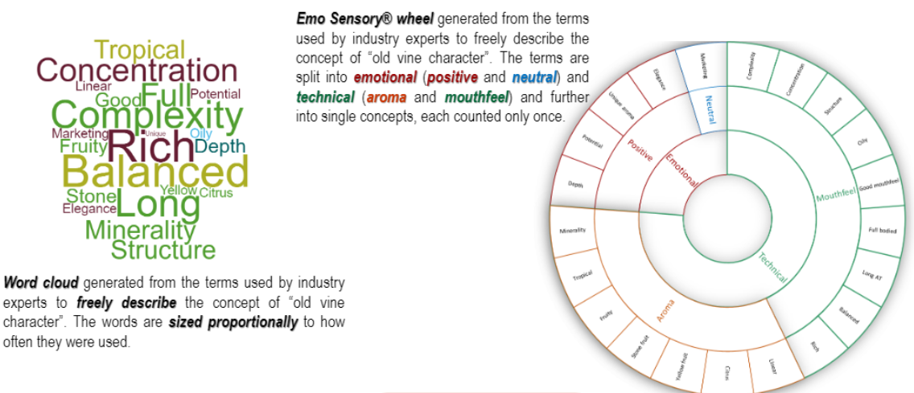
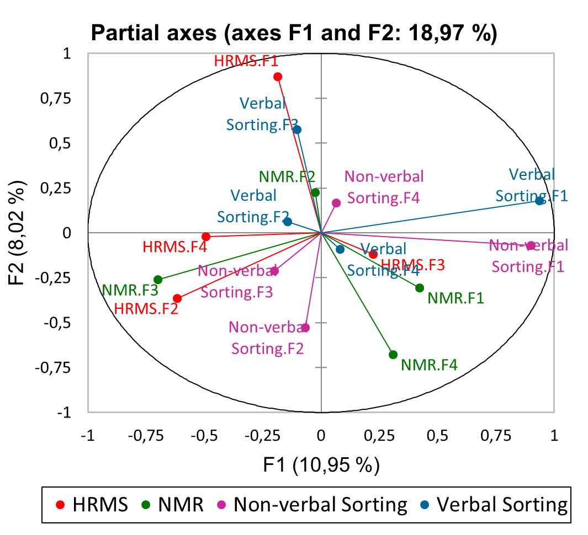
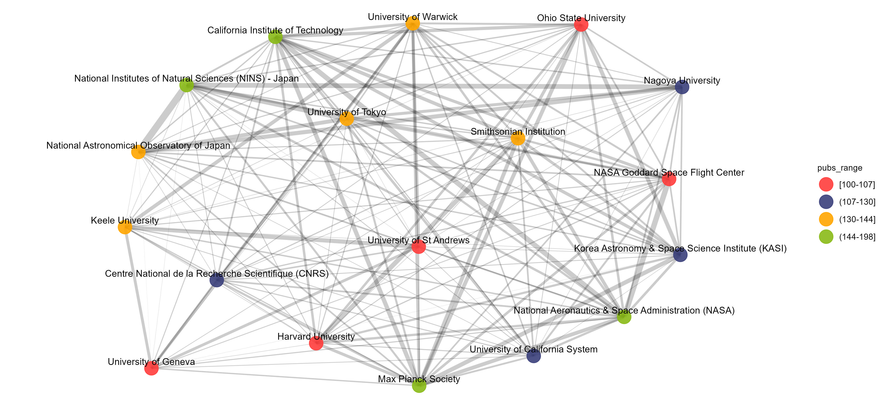
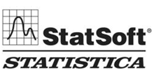
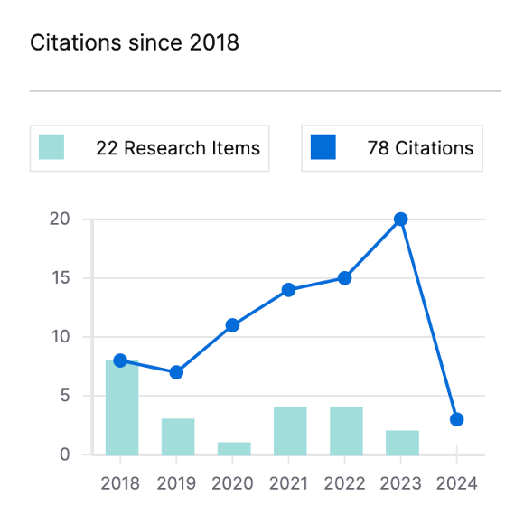

 		
 		
 		

# About me
Hello, my name is Mpho Mafata. I am currently working as a post-doctoral fellow with the database team at the Center for Research on Evaluation Science and Technology ([CREST](https://www0.sun.ac.za/crest/)), South Africa. 

Previously, I was a joint post-doctoral fellow at the South African Grape and Wine Research Institute ([SAGWRI](https://sagwri.sun.ac.za/)), as well as the Stellenbosch University’s School for Data Science and Computational Thinking. I generally work in interdisciplinary environments with very different types of data (structured and unstructured). 

I have practiced technical skills in separation sciences (chromatography) and detection (mass spectrometry, UV-vis and fluorescence spectroscopy), wet lab/preparatory chemistry (sample preparation of organic compounds and natural products), oenology (winemaking and sensory analysis), and multivariate data analysis (MDS, MCA, PCA, MFA). 
My research is in the applications of Data Science in the fields: Analytical Chemistry, Biotechnology, Sensory evaluation, and Oenology.  

## Subject Areas

<table>
 <tr>
	 
<td>
	
__Chromatographic analysis__

<figcaption text-size-adjust: none>
	Unboxing the various structures and complexity in spectral data sets. <a href ="https://github.com/mpho-mafata/Chromatographic-data"> Read more here </a>
</figcaption>

</td>

<td>
	
__Sensory analysis__

<figcaption text-size-adjust: none>
	Focused on the specifics of sensory and consumer data, their structures, and features. <a href ="https://github.com/mpho-mafata/Network-analysis-of-sensory-attributes"> Read more here </a>
</figcaption>
	
</td>
</tr>

 <tr>
	 
<td>

__Multivariate analysis__

<figcaption text-size-adjust: none>
	Analysing data using multivariate toolboxes. Focused on visualization using combinations of graphs. <a href ="https://github.com/mpho-mafata/hplc_scanning"> Read more here </a>
</figcaption>
	
</td>

<td>

__Data science__

<figcaption text-size-adjust: none>
	Analysing data of various structures using SQL, R or Python. Assessing relationships and patterns using fuzzy techniques and network analysis. <a href ="https://github.com/mpho-mafata/Network-analysis"> Read more here </a>
	
</figcaption>
  
</td>

 </tr>
</table>

## Other useful tools I use
### Atlassian agile project management tools

		
		
 			

### other useful tools

		
		
		
		
		
		

### Scientific profile

ResearchGate scientific output neatly presented at https://researchgate.net/profile/Mpho-Mafata/research/ .

My scientific publication list at https://mphomafata.wordpress.com/2023/12/19/my-list-of-publications/ .
