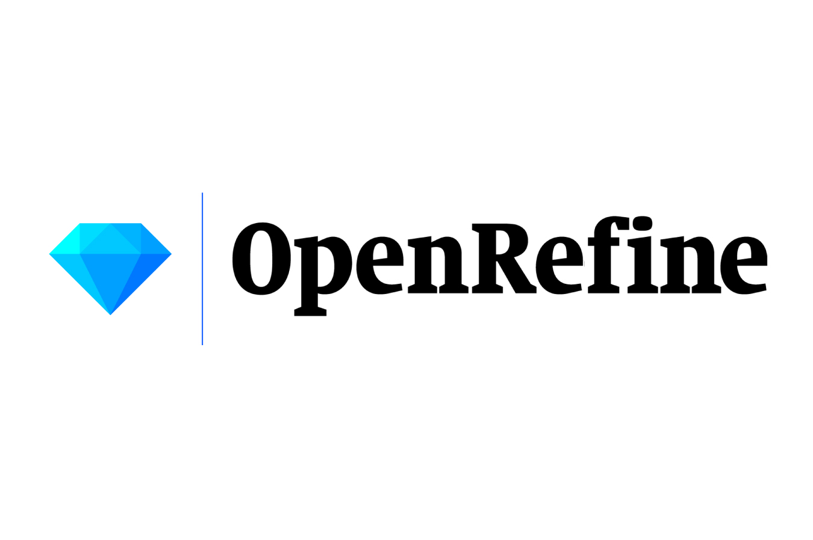

 		
 		
 		
		

# About me
Hello, my name is Mpho Mafata. I use this site to version instructional scripts I use most frequently and those used for generating publications, tutorials and workshop material. I work in interdisciplinary environments with very different types of data (structured and unstructured). 

I have technical skills in separation sciences (chromatography), analytical chemistry (mass spectrometry, UV-vis and fluorescence spectroscopy), wet lab/preparatory chemistry (sample preparation of organic compounds and natural products), oenology (winemaking and sensory analysis), scientometrics (patent statistics), and multivariate data analysis (MDS, MCA, PCA, MFA). 

I love research on the applications of Data Science in the fields: Analytical Chemistry, Biotechnology, Sensory evaluation, Food Science, and Oenology.  

## Subject Areas

<table>
 <tr>
	 
<td>
	
__Chromatographic analysis__

 
<figcaption text-size-adjust: none>
	Unboxing the various structures and complexity in spectral data sets. <a href ="https://github.com/mpho-mafata/Chromatographic-data"> Read more here </a>
</figcaption>

</td>

<td>
	
__Sensory analysis__

 
<figcaption text-size-adjust: none>
	Focused on the specifics of sensory and consumer data, their structures, and features. <a href ="https://github.com/mpho-mafata/Network-analysis-of-sensory-attributes"> Read more here </a>
</figcaption>
	
</td>
</tr>

 <tr>
	 
<td>

__Multivariate analysis__

 
<figcaption text-size-adjust: none>
	Analysing data using multivariate toolboxes. Focused on visualization using combinations of graphs. <a href ="https://github.com/mpho-mafata/hplc_scanning"> Read more here </a>
</figcaption>
	
</td>

<td>

__Data science__

 
<figcaption text-size-adjust: none>
	Analysing data of various structures using SQL, R or Python. Assessing relationships and patterns using fuzzy techniques and network analysis. <a href ="https://github.com/mpho-mafata/Network-analysis"> Read more here </a>
	
</figcaption>
  
</td>

 </tr>
</table>

## Other useful tools I use

		
		
		
		
		
		
		
 		
		
		
		
		
		
		
		
		
 		
	

## Scientific profiles
I have  some old and new poster list presented at conferences, neatly listed here: https://mphomafata.wordpress.com/category/posters/

ResearchGate scientific output neatly presented at https://researchgate.net/profile/Mpho-Mafata/research/ .

My scientific publication list at https://mphomafata.wordpress.com/2023/12/19/my-list-of-publications/ .

## Affiliations
* 2025 - present | [Universitätsklinikum Tübingen, CoFacility for Metabolomics](https://www.linkedin.com/company/cofmetabolomics/), Tübingen, Germany
* 2022 - 2025 | [Center for Research on Evaluation Science and Technology (CREST)](https://www0.sun.ac.za/crest/), Stellenbosch University, South Africa
* 2021 - 2022 | [South African Grape and Wine Research Institute (SAGWRI](https://sagwri.sun.ac.za/), Stellenbosch University, South Africa
* 2020 - 2022 | [Language Centre](https://languagecentre.sun.ac.za/writing-lab/), Stellenbosch University, South Africa
* 2014 - 2022| [School for Data Science and Computational Thinking](https://www.sun.ac.za/english/data-science-and-computational-thinking), Stellenbosch University, South Africa
* 2014 - 2017 | [Agricultural Research Council](https://www.arc.agric.za/arc-infruitec-nietvoorbij/Pages/ARC-InfrNietv-Homepage.aspx), Nietvoorbij, South Africa
* 2009 - 2013 | [Department of Chemistry](https://science.uct.ac.za/department-chemistry), Univesity of Caoe Town, South Africa

## Getting in touch

For collaborations and conversations email  mafata@sun.ac.za 
 
Read more about my research interests at https://mphomafata.wordpress.com/ 
